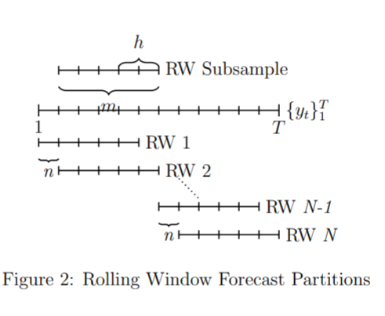

## Voorspellen van de bezettingsgraad op verschillende campuslocaties m.b.v. van WiFi-data

### Een case study over voorspellingsmodellen van tijdseries

door de Hogeschool van Amsterdam (HvA), Lectoraat Urban Analytics (Adil Ayi en Pieter Bons)

In deze case study presenteren wij de resultaten van het Smart Buildingsproject in samenwerking met Facility Services van HvA/UvA. In dit onderzoek gebruiken we geaggregeerde tellingen van het aantal WiFi-verbindingen als proxy voor de bezetting van de gebouwen in de gezamenlijke campus van de Hogeschool van Amsterdam en de Universiteit van Amsterdam. Omdat deze gegevens niet openbaar gemaakt mogen worden demonstreren we de gebruikte technieken door middel van een openbaar beschikbare dataset. Deze dataset is afkomstig van the University of Utah waar metingen zijn uitgevoerd voor de bezettingsgraad van 4 locaties op campus, namelijk:  Auditorium, Dancehall, Labs en Housing. De data is verzameld in de periode van 2018-01-01 t/m 31-12-2018.
In deze korte blog nemen we je mee langs het proces van ons onderzoek waarbij de resultaten van één locatie wordt gepresenteerd.

Er wordt sterk aangeraden om het volledige notebook te bekijken waar ook de conclusies te lezen zijn.

Notebook: https://mybinder.org/v2/gh/DataStudioHvA/Notebook_Binder/main?filepath=Smartbuildings_Python_Notebook.ipynb 

Bronvermelding Data: Legorburu, Gabriel; Smith, Amanda (2020), “Data for: Incorporating Observed Data into Early Design Energy Models for Life Cycle Cost and Emissions Analysis of Campus Buildings”, Mendeley Data, V1, doi: 10.17632/k5ct82yvsv.1

Bezettingsmodellering van gebouwen wordt gebruikt in besluitvormingen door het serviceteam en speelt daarom een sleutelrol in de context van “Smart Buildings” en serviceoptimalisatie. In deze case study voorspellen we de bezettingsgraad voor een grote universiteitscampus. De data die gebruikt wordt komt van de Universiteit van Utah in de VS waar het aantal actieve Wi-Fi-verbindingen op vaste tijdsintervallen op verschillende locaties op campus is bepaald. Wij voeren een modelvergelijking uit voor tijdreeksmodellen: dynamische regressie met seizoensgebonden autoregressieve geïntegreerde voortschrijdend gemiddelde (R-SARIMA) en toestandsruimte Goniometrische Box-Cox getransformeerd met ARIMA-fouten, Trend Seizoenscomponentenmodel (TBATS). 
Deze econometrische modellen worden vergeleken met benchmarks bestaande uit een Judgemental Forecasting-methode (niet-lineair) en een Lineair Model (additief). Onze empirische studie bestaat uit een rollende vensteropstelling (rolling window) met 4 weken aan schattingsgegevens (train) en een voorspellingshorizon tot 7 dagen (test), gegeven een dagelijkse frequentie van 24 metingen. Dit resulteert in een grote out-of-sample voorspelling van 168 meetpunten naar de toekomst. Het onderzoek biedt inzichten voor serviceteams die over vergelijkbare data beschikken en ook de bezettingsgraad willen voorspellen om hun dienstverlening te kunnen verbeteren. Op basis van onze modelvergelijking weet men welk model het beste toegepast kan worden afhankelijke van het type gebouw.

### 1. Data

In deze case study worden vier datasets gebruikt: 'classroom_auditorium', 'classroom_dance', 'classroom_labs', 'data_housing'. Deze data beschrijft de "occupancy" (bezettingsgraad) van de locatie door middel van een genormaliseerde waarde tussen [0,1]. Hierdoor wordt de privacy van de studenten en werknemers van de universiteit van Utah gewaarborgd. Om de spreiding van de data vervolgens te verbeteren en uitschieters te dempen is de data getranformeerd met de volgende variantie-stabiliserende transformatie: 

> $n_{log} = \log(n + 1),\;  n = normalized\:occupancy$ 

De vier datasets beschrijven karakteristieke locaties op een college campus die alleen gebruikt wordt voor de voorspellingen en dus niet met elkaar vergeleken moeten worden. In dit hoofdstuk wordt de data ingeladen en verkend. We zullen zien hoe de 4 locaties elk ander gedrag blijken te vertonen. Het is interessant om na te gaan welke karakteristieken het meest overeenkomen met uw eigen locatie. In deze blog laten wij de methodiek zien voor de dataset van het auditorium, voor de andere gebouwtypes verwijzen we u naar het volledige script zoals hierboven aangegeven.


```{r, echo=FALSE, warning=FALSE}
library(reticulate)
reticulate::use_python(Sys.which('python'), required = TRUE)
```

```{python, warning=FALSE}
# naamgeving van data
names = ['classroom_auditorium', 'classroom_dance', 'classroom_labs', 'data_housing']
names2 = ['nlog_audit', 'nlog_dance', 'nlog_lab', 'nlog_house']
```

```{python, warning=FALSE}
#importeer packages voor deze Demo en zet default instellingen
#import warnings
#from statsmodels.tools.sm_exceptions import ConvergenceWarning
#warnings.simplefilter('ignore', ConvergenceWarning)                                       
                                                               
from IPython.display import display
import numpy as np
import pandas as pd
pd.plotting.register_matplotlib_converters() #panda ignore
pd.options.mode.chained_assignment = None  # default='warn'
#import matplotlib.backends
import matplotlib.pyplot as plt
plt.style.use('seaborn') 
```

```{python, warning=FALSE}
#make a dataframe with all the locations
for n in range(len(names)):
    DATAFILE = 'cleandata_' + names[n] + '.csv' # kies welke dataset, github
    df = pd.read_csv(DATAFILE, index_col=0, parse_dates=True)
    
    if n == 0:
        head_df= df
    else:
        iter_df = df
        head_df = pd.concat([head_df[['nlog']], iter_df[['nlog']]], axis=1)
        
head_df.columns = names2
```
```{python, warning=FALSE, echo = FALSE}
print('Sample of the data:')
display(head_df.head(10))
```
```{python, warning=FALSE, echo = FALSE}
print('Summary of the data:')
display(head_df.describe())
```

Te zien is hoe elke dataset dezelfde hoeveelheid data punten heeft (count). Uit de gemiddeldes is te zien hoe in de locatie *housing* gemiddeld het meeste mensen zijn over de dag, wat logisch is omdat dit het verblijf is van de studenten (iedereen begint zijn dag in bed). Het laagste gemiddelde is te vinden in de *dancehall*, wat ook logisch is gezien het feit dat de dancehall gebruikt wordt voor feesten en gelegenheden (incidenteel).

Hieronder volgt een simple plot van de tijdreeksen. Zo krijgen we een algemene indruk van hoe ze er uitzien door het jaar heen. Het volgende is te zien:

1. De locaties hebben een harde grens voor de minimum en maximum bezettingsgraad. Dit is te zien over het gehele jaar waarbij het maximum nooit overschreden wordt en regelmatig bereikt wordt. Dit is echter logisch omdat een classroom een maximum hoeveelheid zitplaatsen heeft.
2. Het lijkt alsof *Dancehall* veel meer metingen heeft maar dit is niet het geval. Door opeenvolgende maxima ziet de plot er zo uit. De dancehall heeft ook een maximum capaciteit en bereikt die regelmatig. 
3. Het Laboratorium is het meest consistent over het jaar heen. Er is wel duidelijk een periodiek patroon te zien.
4. Housing fluctueert veel over het jaar heen. Leuk is te zien hoe in de zomermaanden de housing op campus een sterke afname ondergaat. Dit is natuurlijk normaal omdat men dan terug naar huis gaat of op vakantie gaat.

```{python, warning=FALSE}
plt.rcParams.update({'font.size': 40})
plt.figure(figsize=(12, 8))
for i in range(1, len(head_df.columns)+1):
    plt.subplot(4, 1, i)
    plt.xlabel('Time(date)')
    plt.ylabel(names[i-1].split('_')[1])

    plt.plot(head_df.index, head_df.iloc[:,i-1], alpha=0.7, label='raw')
    plt.plot(head_df.resample("D").mean().index, head_df.resample('D').mean().iloc[:,i-1], color='r', lw=2, label='resample')
    plt.legend()
```

M.b.v. onderstaande functie kijken we nu naar het weekgemiddelde. Vervolgens plotten wij deze patronen in één figuur.

```{python, warning=FALSE}
# definitie om gemiddelde week te bepalen.
def avgweek(data):
    iso = data
    iso['hour'] = iso.index.hour.values
    iso['weekday'] = iso.index.weekday.values
    iso['week'] = iso.index.isocalendar().week.values

    newiso = iso.pivot_table(index = ['weekday', 'hour'], columns = 'week', margins=False)
    weekgem = newiso.mean(axis=1).values
    return weekgem
```

```{python, warning=FALSE, error = FALSE}
import plotly.graph_objects as go

# Add data
hours = head_df[head_df.index.isocalendar().week == 2].index
audit = avgweek(head_df[[head_df.columns[0]]])
dance = avgweek(head_df[[head_df.columns[1]]])
lab = avgweek(head_df[[head_df.columns[2]]])
house = avgweek(head_df[[head_df.columns[3]]]).tolist()

# Create and style traces
fig = (go.Figure().
add_trace(go.Scatter(x=hours, y=audit, name='Auditorium',
                         line=dict(color='royalblue', width=2))).
add_trace(go.Scatter(x=hours, y=dance, name = 'Dancehall',
                         line=dict(color='orange', width=2))).
add_trace(go.Scatter(x=hours, y=lab, name='Laboratorium',
                         line=dict(color='green', width=2))).
add_trace(go.Scatter(x=hours, y=house, name='Housing',
                         line = dict(color='firebrick', width=2))).
update_layout(title='Gemiddelde Weekpatroon',
                   xaxis_title='Time(hours)',
                   yaxis_title='Normalized Occupancy',
                 xaxis_tickformat = '%a'))
fig.show()
```

Het volgende is op te merken aan de plot:

1. De dancehall heeft het laagste gemiddelde en vertoont geen periodiek patroon.
2. Housing heeft een constant dagpatroon over de hele week. Dit is volgens verwachting omdat men altijd naar huis zal gaan aan het einde van de dag, ook in het weekend.
3. Het auditorium en laboratorium laten allebei een afname in bezetting zien in het weekend en hebben verder een vergelijkbaar patroon. Dit is ook aannemelijk aangezien colleges en practica gegeven worden op schooldagen en niet of nauwelijks tijdens het weekend. Het Auditorium wordt echter wel vaker op een zaterdag gebruikt dan de labs.

>#### 1 Auditorium

Hier volgt een diepere onderzoek naar de auditorium data. Eerst wordt een decompositie uitgevoerd. In de volgende figuur zien we in de eerste plot de ruwe data. De tweede plot geeft de trend weer van de tijdreeks over het gehele jaar (period=365). Hier is goed te zien hoe er in februari een forse incidentele verhoging is. Deze toename houdt aan tot mei 2018. De derde plot geeft de periodieke seizoenscomponent (dag + week patroon) aan. Als laatste zien we de errors die overblijven als we het verschil nemen tussen de ruwe data en de twee gvonden componenten. Het is te zien dat de huidige decompositie op geen variatie binnen een dag meeneemt en dat daarom de error afwisselend positief (overdag is waarde hoger) en negatief ('s nachts is de waarde lager) wordt. 

```{python, warning=FALSE}
from statsmodels.tsa.seasonal import seasonal_decompose
auditorium = head_df[['nlog_audit']]
decomposition = seasonal_decompose(auditorium, model = 'additive', period=(365))
  
fig = decomposition.plot()
fig.set_figwidth(12)
plt.show()
```

Naast de decompositie van de tijdreeks is ook een autocorrelation plot gemaakt om de correlaties tussen waarnemingen zelf en waarnemingen een x-aantal tijdstappen in het verleden (lags). Dit geeft inzicht in welke patronen er in de tijdreeks bestaan, zowel op korte termijn als op de termijn van het seizoenspatroon. 

We zien dat een waarneming het meest lijkt op de waarneming van een uur daarvoor (hoogste autocorrelatie). Ook is te zien is hoe er een dagelijks patroon is waarbij er iedere 24 uur een piek te zien is in de autocorrelatie. Deze dagelijkse autocorrelatie is het hoogst na 168 uur, dit is de zelfde weekdag precies een week eerder, wat aangeeft dat er ook een weekpatroon bestaat.

```{python, warning=FALSE}
from statsmodels.graphics.tsaplots import plot_acf
fig = plot_acf(auditorium,lags=168)
fig.set_figwidth(12)
fig.set_figheight(6)
plt.show()
```

---

Op elke locatie willen we met behulp van deze patronen en karakteristieken de bezettingsgraad gaan voorspellen voor een week in de toekomst. Dit zal gebaseerd zijn op een trainset van 4 weken. Hieruit is meteen duidelijk hoe een jaarlijks verschijnsel niet gemodelleerd kan worden. Echter is het toch interessant om te weten welke modellen met zo weinig informatie de beste voorspelling maakt onder verschillende omstandigheden (locaties op campus). Dit is ook niet voor niets belangrijk omdat in de praktijk facilitymanagers ook alleen actuele meetdata ter beschikking hebben voor voorspellingen wegens privacywetgeving.

---

### 2. Modellen

Het doel van deze case study is om inzichten te geven in de prestaties van verschillende modellen bij het voorspellen van de bezettingsgraad op campuslocaties. De volgende 2 modellen worden getest:

- SARIMA (Seasonal Autoregressive Integrated Moving Average)
- TBATS (Trigonometric Exponential Smoothing State Space model)

Waarbij de volgende 2 modellen als benchmark gebruikt zullen worden:

- Judgemental Forecast (non-linear)
- Linear Model (additive)

Judgemental Forecast is eigenlijk geen tijdreeksmodel maar een operatie op de data waarbij we als 'judge' met simpele aannames een (opzettelijk naïeve) voorspelling doen. De Judgemental forecast fungeert als benchmark in de zin van dat het een referentiepunt is om de modellen te beoordelen (een soort meetstaaf). De Judgemental Forecast die wij hierop uitvoeren is het gemiddelde van de trainset per uur en per weekdag extrapoleren naar de toekomst. De voorspelling is dus het gemiddelde van de 4 weken ervoor. In kan wiskundige opgeschreven als:

>$x^{ - t, k}_{i, j}=  \frac{1}{k}  \sum_{(i,j) \in H_{w}} y_{i,j},\;\; t=w, w+1,w+2,...,\;\; k= 1,...,4$

---

Nu volgt de code van de modellen waarmee de voorspellingen zijn gemaakt in deze case study. De berekeningen worden niet gerund in dit notebook wegens de lange rekentijd. De functies die gedefinieerd zijn nemen als input de train en test datasets en geven de voorspelling terug voor de periode van één week na het einde van de train set. Het is mogelijk om zelf te kiezen om een langere of korte periode als train of test set aan te bieden mocht dat van toepassing zijn op uw eigen situatie.

```{python, warning=FALSE}
from tbats import TBATS

def SARIMA(train, test):
    exog_test = np.array(test['weekend'])
    exog_test = exog_test.reshape(exog_test.shape[0],1)

    model_SARIMA = sm.tsa.statespace.SARIMAX(train['nlog'], exog = train['weekend'], order=(1, 1, 1),seasonal_order=(2, 1, 0, 24))
    model_SARIMA = model_SARIMA.fit()

    sarima_predict = model_SARIMA.predict(start=test.index[0], end=test.index[-1], exog = exog_test)
    return sarima_predict

def getdummies(wdf):
    wdf['hour'] = wdf.index.hour 
    wdf['DayOfWeek'] = wdf.index.day_name()

    dummies  = pd.get_dummies(wdf['DayOfWeek'].astype('object'))
    dummiess = pd.get_dummies(wdf['hour'].astype('object'))
    wdf      = pd.concat([wdf,dummies, dummiess],axis=1)
    wdf      = wdf.drop(columns=['n', 'hour', 'DayOfWeek'], axis=1)
    wdf = wdf.reset_index()
    
    x = wdf.drop(columns=['nlog', 'index'], axis=1)
    y = wdf['nlog']
    return x, y

def LM(train, test):
    tr = getdummies(train)
    te = getdummies(test)
    
    mlr = LinearRegression()
    mlr.fit(tr[0], tr[1])
    lm_pred = mlr.predict(te[0])
    return lm_predict

def JF(train, test):
    iso = train[['nlog']]
    iso['hour'] = iso.index.hour.values
    iso['weekday'] = iso.index.weekday.values
    iso['week'] = iso.index.week.values

    newiso = iso.pivot_table(index = ['weekday', 'hour'], columns = 'week', margins=False)
    jf_predict = newiso.mean(axis=1).values
    return jf_predict

estimator = TBATS(seasonal_periods=[24, 24*7]) # need before to minimize calculationtime
def TBATS_use(train, test):
    fitted_model = estimator.fit(train['nlog'])
    tbats_predict = fitted_model.forecast(steps=24*7)
    return tbats_predict
```

### 3. Resultaat

Voor elke train- en testcombinatie zijn voor iedere campuslocatie voorspellingen uitgerekend. Zoals eerder besproken is er gebruik gemaakt van een rolling window van 4 weken (zie Figure 2). Dit resulteert dus in 48 train-test sets. In totaal zijn er dus voor de laaste 48 weken in het jaar 2018 op vier locaties voorspellingen gemaakt voor de bezettingsgraad. In totaal zijn dit 48 (weken) * 4 (locaties) * 4 (modellen) = 768 voorspellingen. Elke voorspelling is een week aan met een meetfrequentie van een uur (168 datapunten).


---
In dit hoofdstuk analyseren wij de voorspellingen en evalueren we welk model het beste past bij ieder van de 4 locaties op campus. Hiervoor kijken wij eerst naar het jaarpatroon. Dit geeft inzicht in hoe jaarlijkse seizoenspatronen zijn opgepakt door het model. Vervolgens wordt per week de root-mean-square error (RMSE), een maat voor de gemiddelde fout in een voorspelling, berekend van ieder model om de voorspelling kwantitatief te kunnen beoordelen.

> $RMSE = \sqrt{\frac{\sum_{i=1}^{N}{\Big({Predicted_i - Actual_i}\Big)^2}}{N}}$

Door deze resultaten te combineren met de kenmerken van de specifieke tijreeksen kan nu per gedragspatroon bepaald worden welk model het beste bij welk soort locatie past. Een korte samenvatting van wat we in hoofdstuk 1 gevonden hebben uit data exploratie:

> Auditorium en Laboratorium bevatten een beetje van zowel het gedrag van de dancehall als de housing. Studenten hebben alleen op werkdagen college en practica en in het weekend is de faciliteit wel open maar is het gebruik minder consequent. Er is dus meer onzekerheid over de bezetting van het lab in het weekend. Gemiddeld zien op werkdagen hoge occupancy en in het weekend een scherpe daling.

Hieronder beginnen wij eerst met het inladen van de resultaten die vooraf al berekend zijn en plotten wij de resultaten. 

```{python, warning=FALSE, echo = TRUE, results = 'hide'}
Location = [x.split('_')[-1] for x in names][0]

df = pd.read_csv('results/results_' + Location + '.csv', index_col=0, parse_dates=True)

fig, ax = plt.subplots(5, 1)
fig.suptitle(Location.capitalize() , fontsize=25)
df['Real'].plot(ax=ax[0], color='red', alpha=0.6)
ax[0].set_ylim(0,1)
df['Sarima'].plot(ax=ax[1], color = 'blue')
ax[1].legend(["SARIMA"], bbox_to_anchor=(1.0, 0.5), loc='upper left', fontsize = 13);
ax[1].set_ylim(-1,1.5)
df['LM'].plot(ax=ax[2], color = 'green')
ax[2].legend(["LM"], bbox_to_anchor=(1.0, 0.5), loc='upper left', fontsize = 13);
ax[2].set_ylim(0,1)
df['JF'].plot(ax=ax[3], color = 'purple')
ax[3].legend(["JF"], bbox_to_anchor=(1.0, 0.5), loc='upper left', fontsize = 13);
ax[3].set_ylim(0,1)
df['TBATS'].plot(figsize=(11,8), ax=ax[4], color= 'black')
ax[4].legend(["TBATS"], bbox_to_anchor=(1.0, 0.5), loc='upper left', fontsize = 13);
ax[4].set_ylim(0,1)
fig.text(0.5, 0.06, 'Time(months)', ha='center',fontsize=15)
fig.text(0.0, 0.5, 'Normalized Occupancy', va='center', rotation='vertical',fontsize=15)
plt.show()
```

In bovenstaande plot is in één oogopslag te zien in hoe de voorspellingen zich verhouden tot de echte metingen. We kunnen de volgende conclusies trekken:

- Auditorium: Voor het auditorium is te zien hoe het SARIMA model op 4 weken gebaseerd veel weging geeft aan de seasonality in de trainset. zo schiet het model vaak uit de bocht omdat het de non stationariteit van de trainset extrapoleert. Echter is wel mooi te zien dat het plotselinge veranderingen in trend wel goed worden gemodelleerd. Dit is ook te zien in het Linear model en Judgemental forecasting. Hierbij heeft het model echter wel nog paar weken nodig om zich aan te passen aan het nieuwe gemiddelde. Tussen deze modellen lijkt JF een betere voorspelling te maken als we vanaf augustus kijken. Hier wordt de ondergrens beter benaderd. TBATS doet het ook zeer goed waarbij, in tegenstelling tot SARIMA, de voorspelling altijd in de goede orde van grootte blijft en niet uitschiet bij plotselinge veranderingen.

Om nu kwanitatief iets te zeggen over de prestaties van elk model volgt hieronder de analyse met de RMSE per rolling window voorspelling.

```{python, warning=FALSE}
import plotly.express as px

location = [x.split('_')[-1] for x in names][0]

df2 = pd.read_csv('results/Errors_' + location + '.csv', index_col=0, parse_dates=True)

fig = px.line(df2.reset_index(), x='index', y=df2.columns.tolist(), width=900, height=500, 
             title=f"Errors: {location}")

fig.update_layout(
xaxis_title="Time(date)",
yaxis_title="RMSE",
legend_title="Model:",
).show()
```

In de figuur hierboven is de RMSE plot te zien.

- Auditorium: De hoogste error komt voor bij de overgang van een hoge occupancy naar een langdurige verlaging. In de errorplot is dit te zien vanaf week 18. Als we inzoomen op week 19 is te zien hoe vanaf 11 mei de occupancy uit het niets daalt. Te zien is hoe de eerste voorspellingen dit effect nog niet hebben opgepakt. In week 20 zien we dat SARIMA de daling extrapoleert tot aan negatieve waardes terwijl de andere modellen in de juiste orde van grootte blijven voorspellen. 

Het process hierboven is voor de andere 3 locaties ook uitgevoerd en is te zien in het volledige notebook. Voor deze diepere uitwerking bekijk de notebook waar alle plots te zien zijn.

Notebook: https://mybinder.org/v2/gh/DataStudioHvA/Notebook_Binder/main?filepath=Smartbuildings_Python_Notebook.ipynb 

--- 

Hier volgt de analyse van alle locaties. De RMSE wordt gebruikt om te tellen in hoeveel weken een model "het beste" presteerde (laagste error). In de code hieronder wordt deze berekening uitgevoerd. 

```{python, warning=FALSE}
#berekeningen best model
for i in range(len(names)):
    df = pd.read_csv('results/results_' + names[i].split('_')[-1] + '.csv', index_col=0, parse_dates=True)
    df2 = pd.read_csv('results/Errors_' + names[i].split('_')[-1] + '.csv', index_col=0, parse_dates=True)
        
    l = []
    for j in df2.index:
        l.append(df2.columns[df2[df2.index == j].values.argmin()])
    
    if i == 0:
        main = pd.DataFrame(index=range(5, 53), data=l, columns=['best_' + names[i].split('_')[-1]])
        models = set(l)
    else:
        main['best_' + names[i].split('_')[-1]] = l
    
    bestmodel2 = [l.count(x) if l.count(x) > 0 else 0 for x in models]
    
    if i == 0:
        data = {names[i]:bestmodel2} 
        newmain = pd.DataFrame(data, index=models)
    else:
        newmain[names[i]] = bestmodel2
        
newmain.columns = [x.split('_')[-1].capitalize() for x in newmain.columns]
```

```{r, warning=FALSE, echo = FALSE}
print('bestmodel count:')
r_df <- reticulate::py$newmain
knitr::kable(r_df)
```

```{r, warning=FALSE, echo = FALSE, message = FALSE}
library(dplyr)
library(tidyr)

getmode <- function(v) {
   uniqv <- unique(v)
   uniqv[which.max(tabulate(match(v, uniqv)))]
}

print('summary of bestmodel:')
r_df2 <- reticulate::py$main
r_df_sum = r_df2 %>% 
  pivot_longer(names_to = "location", values_to = "winner", cols = 1:4) %>% 
  mutate(location = substring(location, 6)) %>% 
  group_by(location) %>% 
  filter(winner == getmode(winner)) %>% 
  summarise(best_model = first(winner),
            number_of_wins = n())

knitr::kable(r_df_sum)
```

```{python, warning=FALSE, results = 'hide'}
newmain.plot(kind='bar', stacked=True, figsize=(12,5), rot=0)
plt.ylabel('Count Best Model')
plt.show()
```

Voor elke locatie is geteld hoevaak elk model het beste presteerde. Oftewel hoe goed een model het weekpatroon kan voorspellen op basis van een maand aan historische traindata. Het volgende is op te merken aan de resultaten (output tweede cel hierboven):

- TBATS is voor 3 van de 4 locaties het beste model (top), maar twee van de drie keer is dat niet overtuigend maar met een verschil van 1 a 2 betere weken. Voor de enige locatie waar hij niet op nummer één staat (het auditorium) staat hij op de 2e plaats.
- SARIMA staat 3 keer op de laatste plaats. In de dancehall en labs komt hij geen enkele week naar voren als beste. op de housing dataset presteert SARIMA echter wel erg goed. 
- Judgemental Forecasting is voor het auditorium de overtuigende winnnaar maar bij de dancehall is hij geen enkele keer als beste naar voren gekomen en ook bij de housing is JF het slechtst presterende model.
- Het Linear model lijkt het meest consistent te zijn over de verschillende locaties. 

**Voor de conclusies en uitwerkingen bekijk het volledige NOTEBOOK op: https://mybinder.org/v2/gh/DataStudioHvA/Notebook_Binder/main?filepath=Smartbuildings_Python_Notebook.ipynb**

 