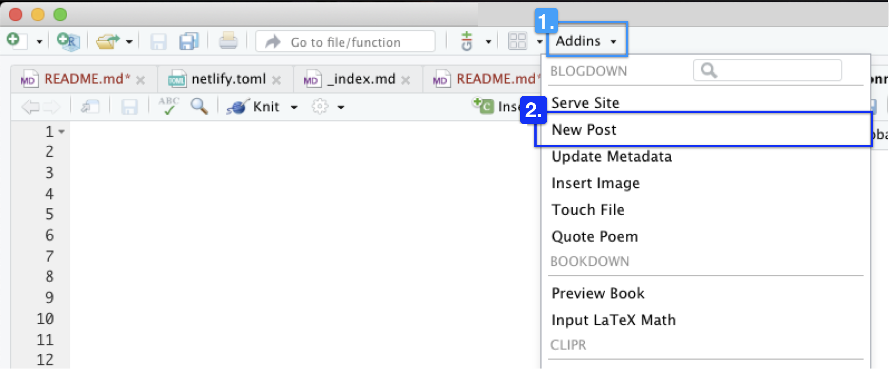
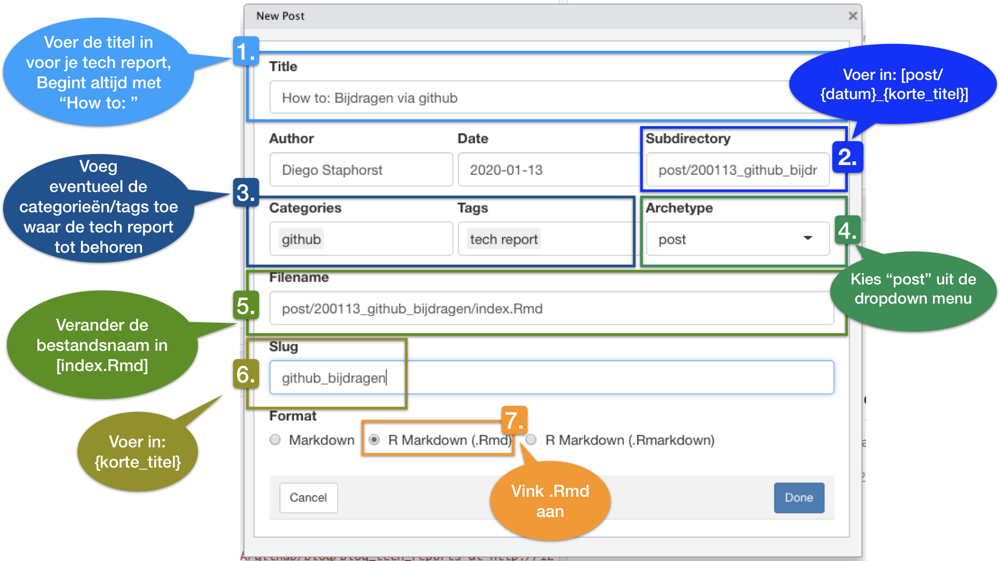
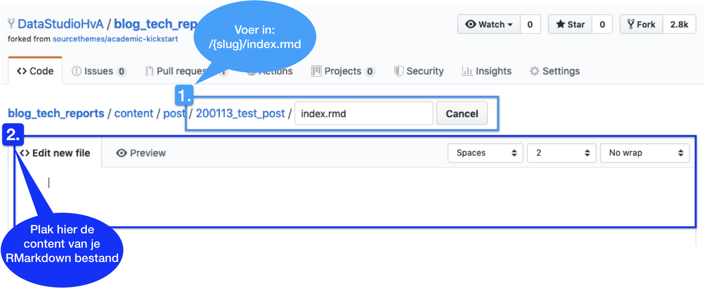

# Het schrijven van tech reports
In deze markdown ga ik verschillende methoden beschrijven hoe er tech reports kunnen worden geplaats op de website. Dit gebeurt voornamelijk met Rmarkdown, dit is een bestands formaat, waarmee R code met zijn output kan wornen weergegeven. Zo kunnen bijvoorbeeld stukken code ook worden meegenomen in de uiteindelijke output van het document. Het is ook mogelijk om jupyter notebook als tech reports aan te maken, dit zal in een update worden beschreven.

## Een nieuwe post maken
Het maken van een tech report kan heel gemakkelijk, in de volgende serie plaatjes wordt dit weergegeven. 

De volgende afbeelding is een screenshot van RStudio, dus we nemen hierbij aan dat je [R](https://www.r-project.org) en [Rstudio](https://www.rstudio.com) geinstalleerd hebt.

Installeer blogdown, door de volgende regel in je console te plakken.

```r
## Install from CRAN
install.packages("blogdown")
```

Je moet ook de static website generator Hugo installeren, plak de volgende regel in de console:

```r
blogdown::install_hugo()
```


### Openen nieuwe post


### Gegevens instellen
In de volgende afbeelding zie je hoe jij je specifieke gegevens moet instellen als je een nieuwe post wilt genereren. Volg de stappen die in de afbeelding staan weergeven



### Je post op github plaatsen via de website
Door een nieuwe folder aan te maken via de github website zou de workflow simpeler kunnen zijn. Met deze methode zou je niet de gehele repository van de website hoeven te downloaden. Via RStudio zou je dan je tech report kunnen schrijven, test en editten totdat het een rapport is die publiceerbaar is.


Hierna kan je beginnen met het typen van de blogpost. 

### Je post op github plaatsen via gitkraken
Door gebruik te maken van RStudio en jouw favoriete method om connectie te maken met deze github repository, zou je je workflow kunnen bevorderen. Hieronder staat een korte beschrijving hoe dat in zijn werk zou gaan.
  
Er zijn verschillende manieren om te helpen aan de website, in deze blogpost focussen we ons op het maken van blogposts. Een voorwaarde is dat je een github account hebt, een basisbegip van git en github hebt. Hieronder staan een aantal resources, om je kennis qua git en github op te frissen!

* [Github.com](https://github.com)
* [Github guides](https://guides.github.com/)

Git kan op verschillende manieren worden gebruikt, zo kan je dat doen via de terminal, maar ook via een Graphical User Interface (GUI). Zelf gebruik ik [GitKraken](https://www.gitkraken.com/), het geeft een duidelijk overzicht wat er gebeurt in de repository.  Zij bieden ook trainingen aan die de flow van github intuitiever maken, [Learn Git with Gitkraken](https://www.gitkraken.com/learn-git).

Nu zou je je eerste bijdragen moeten kunnen maken aan dit project! Laten we beginnen hiermee, door deze [video](https://www.youtube.com/watch?v=j_qpzND5yAg) te bekijken. Een samenvatting van de stappen staan hieronder:

1. Vork de repository en kloon hem naar je desktop
2. Maak een branch voor je blogpost
3. Pas de bestanden aan/Maak je post (hoe dit moet staat hierboven)
4. Commit naar veranderingen naar je gemaakte branch
5. Maak een nieuwe pull request
6. Wacht op review van je pull request

Deze stappen staan uitvoerig beschreven in de volgende link [beginners guide to contributing](https://akrabat.com/the-beginners-guide-to-contributing-to-a-github-project/).
  